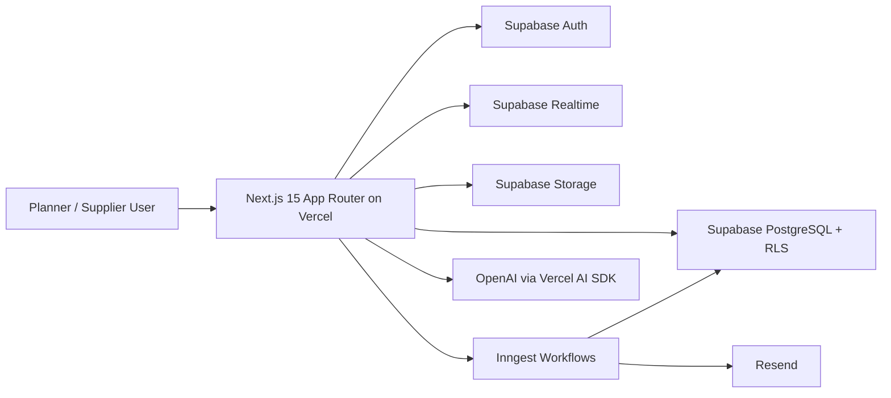
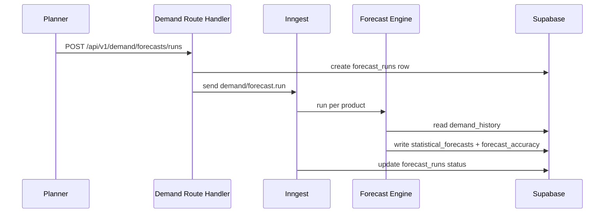
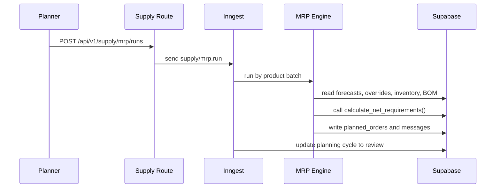
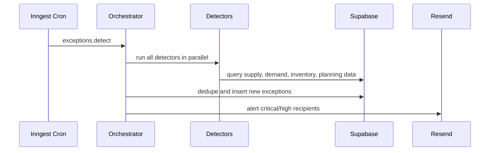

# Architecture

## System Overview

## Key Architecture Decisions

### Why Next.js App Router

- Route handlers, React Server Components, and server actions keep feature code colocated.
- The planner workspace benefits from server-side data fetching for low-latency first paint.
- Route groups cleanly separate planner, portal, and auth experiences.

### Why Supabase

- Row Level Security is the core multi-tenant isolation layer.
- Realtime broadcast channels support collaborative planning without maintaining custom socket infrastructure.
- Auth, Storage, and PostgreSQL reduce platform sprawl for the MVP.

### Why Inngest

- Forecast runs, MRP, KPI refresh, scorecards, imports, reports, and exception detection all need retries and scheduling.
- Inngest provides fan-out workflows and cron without owning queue infrastructure.
- Function steps isolate failures cleanly and make long-running work observable.

### Why Vercel

- Next.js deployment is zero-friction.
- Preview deployments fit the product’s fast iteration model.
- Edge/runtime split allows auth-adjacent paths to stay fast while keeping DB and file generation on Node.js routes.

## Data Flow: Forecast Run

## Data Flow: MRP Run

## Data Flow: Exception Detection

## Realtime Concurrent Planning

- Each planning session maps to a Supabase Realtime broadcast channel: `planning:session:{sessionId}`.
- Cell edits are optimistic in the UI and then persisted through route handlers.
- Presence tracks active collaborators with lightweight user state.
- Impact calculations run asynchronously via Inngest and broadcast summarized results back to the session.
- The database remains the source of truth while Realtime handles low-latency collaboration.
