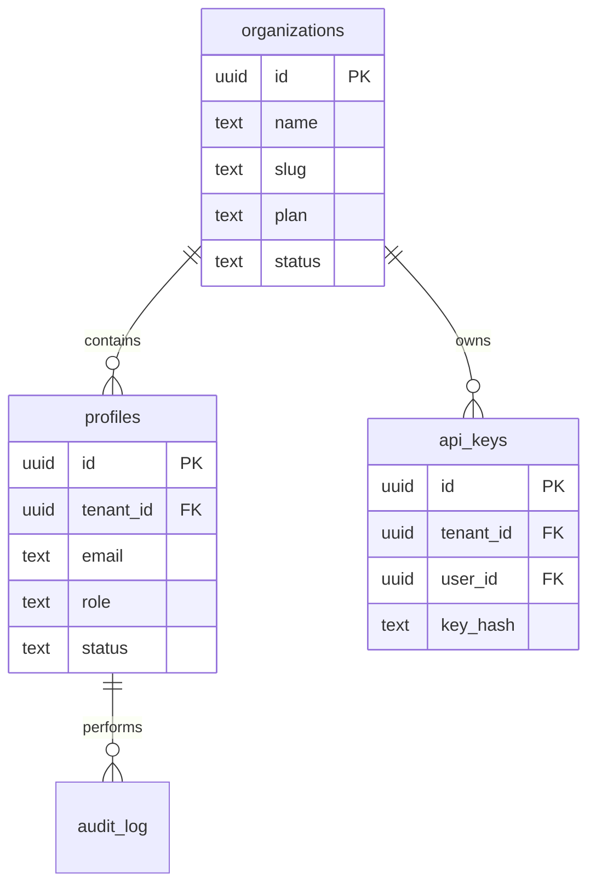
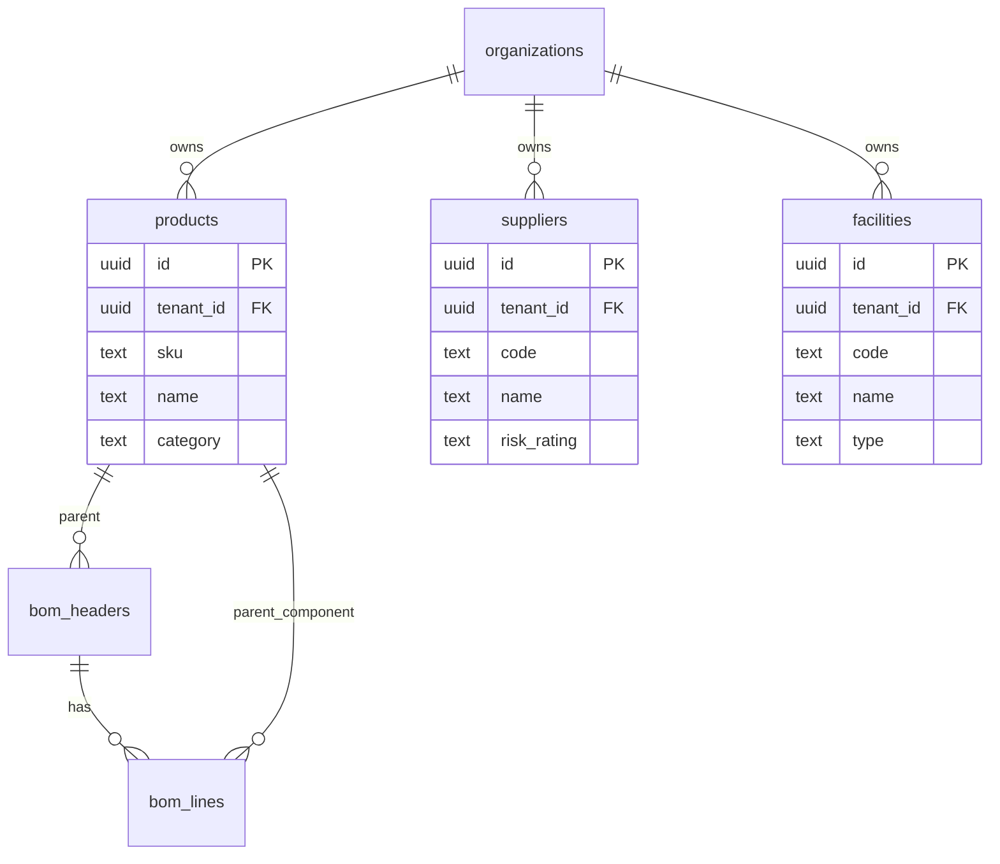
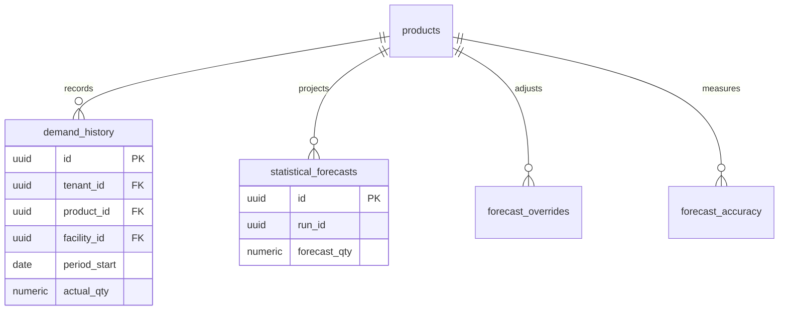
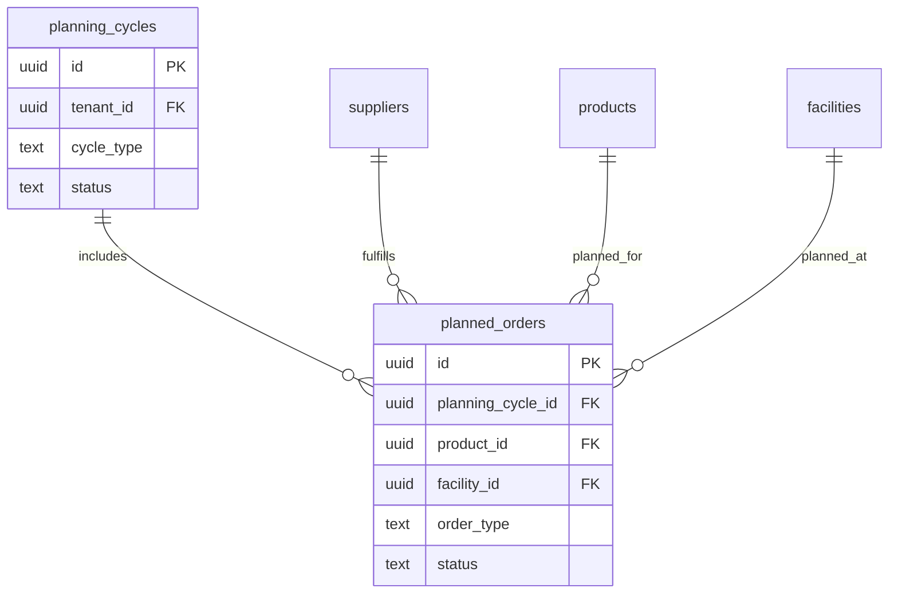
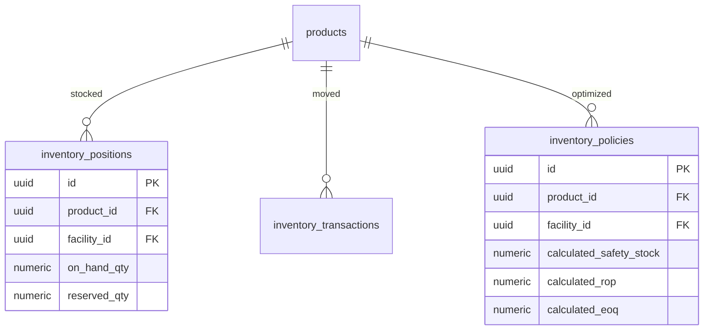
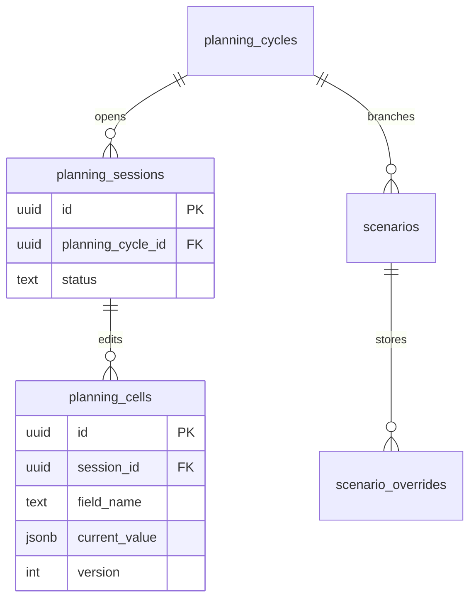
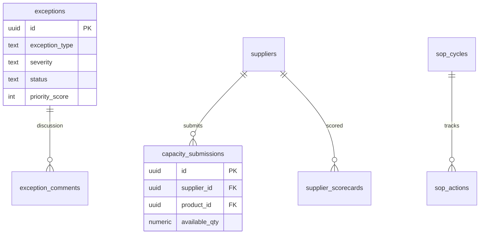
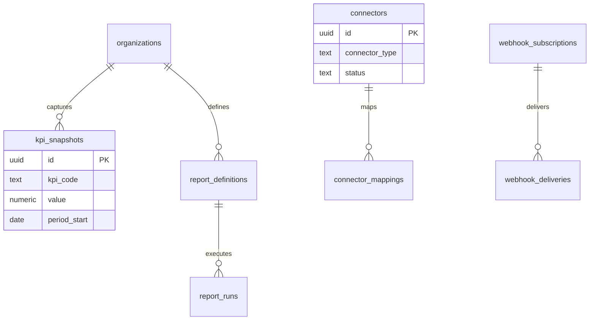

# Data Model

## Auth and Tenant Domain

## Master Data Domain

## Demand Domain

## Supply Domain

## Inventory Domain

## Planning and Scenario Domain

## Exceptions and Collaboration Domain

## Analytics and Integration Domain

